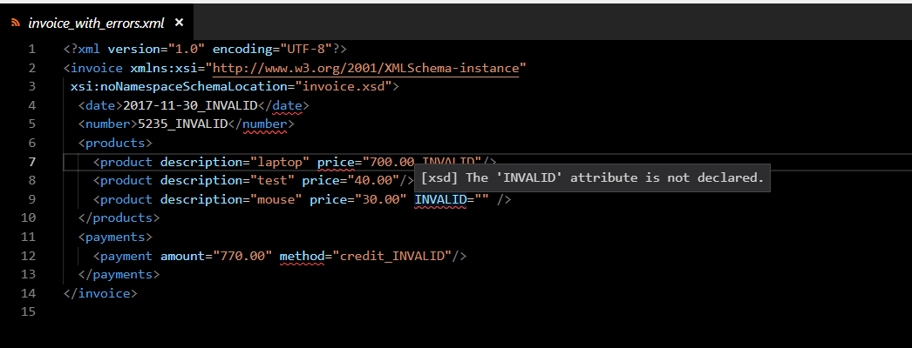

# Xml Validator
This extensions performs is a language service extension for XML files which uses XSD schema definition 
to perform validation of the xml in real time as you edit xml files.



### XSD Attributes
Xml Validator uses the XSD annotations to perform schema validation.

To associate the XSD with your xml file you need to include the **xmlns:xsi** namespace and either add an  **xsi:noNamespaceSchemaLocation** or **xsi:schemaLocation** attribute which gives the xsd which defines your schema.
 
Here is an example of noNamespaceSchema attribute
```xml
<?xml version="1.0" encoding="UTF-8"?>
<invoice 
     xmlns:xsi="http://www.w3.org/2001/XMLSchema-instance"
     xsi:noNamespaceSchemaLocation="invoice.xsd">
```

Or in this example associating that prefix **tns** and namespace **http://invoice** is defined in an xsd named **invoice.xsd**.

```xml
<?xml version="1.0" encoding="UTF-8"?>
<tns:invoice 
    xmlns:tns="http://invoice" 
    xmlns:xsi="http://www.w3.org/2001/XMLSchema-instance"
    xsi:schemaLocation="http://invoice invoice.xsd ">
```

You can specify multiple namespaces in a row in one attribute like this:
```xml
<tns:invoice 
    xsi:schemaLocation="http://uri1 uri1.xsd http://uri2 uri2.xsd http://uri3 uri3.xsd"
```

### Prerequisites
This extension requires [.NET Core](https://www.microsoft.com/net/download) to be installed. 

